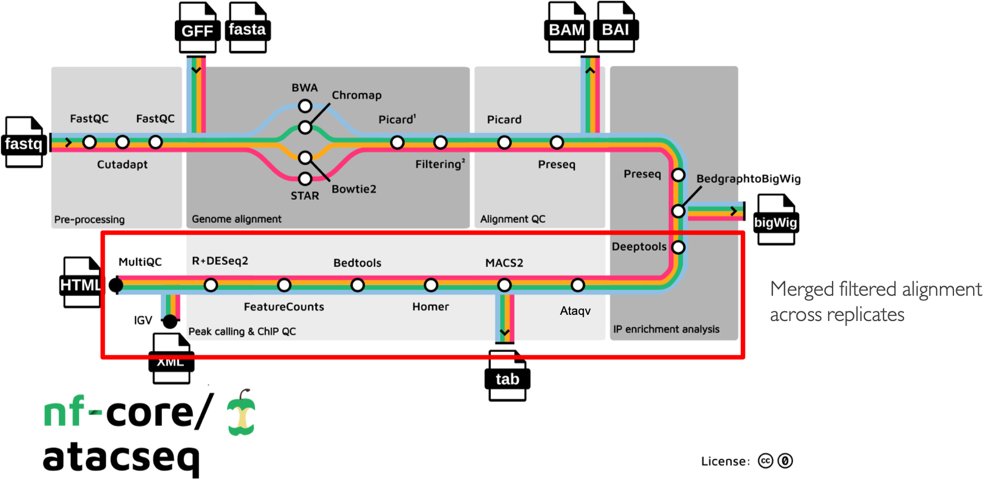

.. _ATAC-seq_pipeline-page:

***************
nf-core/atacseq
***************

Introduction
============

`nfcore/atacseq <https://nf-co.re/atacseq>`__ is a bioinformatics best-practice pipeline used for the analysis of ATAC-seq data. As discussed before, 
the pipeline is built using `Nextflow <https://www.nextflow.io/>`__, a workflow manager to run tasks across multiple compute infrastructures in a 
very portable manner. It uses Docker/Singularity containers making installation trivial and results highly reproducible. 
The `Nextflow DSL2 <https://www.nextflow.io/docs/latest/dsl2.html>`__ implementation of this pipeline uses one container per process which makes 
it much easier to maintain and update software dependencies. Where possible, these processes have been submitted to and installed from 
`nf-core/modules <https://github.com/nf-core/modules>`__ in order to make them available to all nf-core pipelines, and
to everyone within the Nextflow community.

The DSL2 version of the pipeline was implemented by `Björn Langer <https://github.com/bjlang>`_ and `Jose Espinosa-Carrasco <https://github.com/joseespinosa>`_ 
taking into account Gabriel Costa's suggestions and with the help of `Harshil Patel <https://github.com/drpatelh>`_ in the framework of the BovReg project.

Pipeline summary
================

    
The main functionality of the nf-core/atacseq is summarised in the figure above and listed in the following numbered list:

    1. Raw read QC (FastQC)
    2. Adapter trimming (Trim Galore!)
    3. Choice of multiple aligners 
        1.(BWA) 
        2.(Chromap) For paired-end reads only working until mapping step since the `resulting BAMs are faulty <https://github.com/nf-core/chipseq/issues/291>`__ 
        3.(Bowtie2) 
        4.(STAR)
    4. Mark duplicates (picard)
    5. Merge alignments from multiple libraries of the same sample (picard)
        1. Re-mark duplicates (picard)
        2. Filtering to remove:
            * reads mapping to mitochondrial DNA (SAMtools)
            * reads mapping to blacklisted regions (SAMtools, BEDTools)
            * reads that are marked as duplicates (SAMtools)
            * reads that arent marked as primary alignments (SAMtools)
            * reads that are unmapped (SAMtools)
            * reads that map to multiple locations (SAMtools)
            * reads containing > 4 mismatches (BAMTools)
            * reads that are soft-clipped (BAMTools)
            * reads that have an insert size > 2kb (BAMTools; paired-end only)
            * reads that map to different chromosomes (Pysam; paired-end only)
            * reads that arent in FR orientation (Pysam; paired-end only)
            * reads where only one read of the pair fails the above criteria (Pysam; paired-end only)
        3. Alignment-level QC and estimation of library complexity (picard, Preseq)
        4. Create normalised bigWig files scaled to 1 million mapped reads (BEDTools, bedGraphToBigWig)
        5. Generate gene-body meta-profile from bigWig files (deepTools)
        6. Calculate genome-wide enrichment (deepTools)
        7. Call broad/narrow peaks (MACS2)
        8. Annotate peaks relative to gene features (HOMER)
        9. Create consensus peakset across all samples and create tabular file to aid in the filtering of the data (BEDTools)
        10. Count reads in consensus peaks (featureCounts)
        11. Differential accessibility analysis, PCA and clustering (R, DESeq2)
        12. Generate ATAC-seq specific QC html report (ataqv)
    6. Merge filtered alignments across replicates (picard)
            1. Re-mark duplicates (picard)
            2. Remove duplicate reads (SAMtools)
            3. Create normalised bigWig files scaled to 1 million mapped reads (BEDTools, bedGraphToBigWig)
            4. Call broad/narrow peaks (MACS2)
            5. Annotate peaks relative to gene features (HOMER)
            6. Create consensus peakset across all samples and create tabular file to aid in the filtering of the data (BEDTools)
            7. Count reads in consensus peaks relative to merged library-level alignments (featureCounts)
            8. Differential accessibility analysis, PCA and clustering (R, DESeq2)
    7. Create IGV session file containing bigWig tracks, peaks and differential sites for data visualisation (IGV)
    8. Present QC for raw read, alignment, peak-calling and differential accessibility results (ataqv, MultiQC, R)

Run nf-core/atacseq with test data
==================================

As discussed previously `here <https://bovreg.github.io/atacseq-workshop-limoges/nf-core.html#running-pipelines-with-test-data>`__ 
nf-core pipelines include a special configuration named ``test`` that enables to run the whole pipeline with a small subsampled 
dataset. Since the AWS environment provided has not enough computational resources, we will use this test profile to showcase 
the pipeline functionality during this tutorial.

We will first launch the pipeline using the nf-core ``launch`` command and the minimal set of parameters to run the nf-core/atacseq 
pipeline with the test data set. Below, you will find several snippets to guide to chose the correct parametrisation during this process:

* Call the nf-core tools launch command:

    .. code-block:: console
            
            nf-core launch

* Make sure you chose the development version of the pipeline:

    .. code-block:: console
        
        Select release / branch: (Use arrow keys)
            1.2.2  [release]
            1.2.1  [release]
            1.2.0  [release]
            1.1.0  [release]
            1.0.0  [release]
            » dev  [branch]
            master  [branch]
            multiqc_fail  [branch]
            schema  [branch]

* Then, make sure that you set the ``test`` and the ``docker`` profiles. The former will load the settings for the test dataset run and the latter will set the settings for launching the pipeline using `Docker <https://www.docker.com/>`__.

    .. code-block:: console

        ?  Nextflow command-line flags 
        General Nextflow flags to control how the pipeline runs.                                                                                                       
        These are not specific to the pipeline and will not be saved in any parameter file. They are just used when building the nextflow run launch command.          
        (Use arrow keys)

        » Continue >>
        ---------------
        -name
        -profile  [test,docker]
        -work-dir  [./work]
        -resume  [False]

* Now, provide the ``required`` parameters, the ``input`` for the input samplesheet and the ``outdir`` to dump the pipeline results.

    .. code-block:: console

        ?  Input/output options 
        Define where the pipeline should find input data and save output data.                                                                                         
        (Use arrow keys)
         » Continue >>
            ---------------
            input  [https://raw.githubusercontent.com/nf-core/test-datasets/atacseq/samplesheet/v2.0/samplesheet_test.csv]
            fragment_size  [200]
            seq_center
            read_length
            outdir  [results_test]
            email
            multiqc_title

* Finally, we will just leave the rest of the parameters set as default until reaching the final prompt:

    .. code-block:: console

        (Use arrow keys)
          Continue >>
        INFO     [✓] Input parameters look valid                                                                                                          schema.py:213
        INFO     Nextflow command:                                                                                                                        launch.py:724
                nextflow run nf-core/atacseq -r dev -profile "test,docker" -params-file "nf-params.json"                                                              
                                                                                                                                                                    
                                                                                                                                                                    
        Do you want to run this command now?  [y/n] (y): 

Samplesheet input
=================

To provide the samples to the pipeline, you will need to create a samplesheet with information about
the samples you would like to analyse, similar to the one shown below.

.. code-block:: console

	sample,fastq_1,fastq_2
	OSMOTIC_STRESS_T0_REP1,https://raw.githubusercontent.com/nf-core/test-datasets/atacseq/testdata/SRR1822153_1.fastq.gz,https://raw.githubusercontent.com/nf-core/test-datasets/atacseq/testdata/SRR1822153_2.fastq.gz
	OSMOTIC_STRESS_T0_REP2,https://raw.githubusercontent.com/nf-core/test-datasets/atacseq/testdata/SRR1822154_1.fastq.gz,https://raw.githubusercontent.com/nf-core/test-datasets/atacseq/testdata/SRR1822154_2.fastq.gz
	OSMOTIC_STRESS_T15_REP1,https://raw.githubusercontent.com/nf-core/test-datasets/atacseq/testdata/SRR1822157_1.fastq.gz,https://raw.githubusercontent.com/nf-core/test-datasets/atacseq/testdata/SRR1822157_2.fastq.gz
	OSMOTIC_STRESS_T15_REP2,https://raw.githubusercontent.com/nf-core/test-datasets/atacseq/testdata/SRR1822158_1.fastq.gz,https://raw.githubusercontent.com/nf-core/test-datasets/atacseq/testdata/SRR1822158_2.fastq.gz

The file above, is a comma-separated values (CSV) file with three columns. It can be provided to the pipeline using 
the ``input`` parameter.

Multiple runs of the same sample
--------------------------------

If you have re-sequenced the same sample several times to increase its sequencing depth, you can input this information
to the pipeline by using the same sample identifier. The pipeline will concatenate the raw reads before performing any 
downstream analysis. Below is an example for the same sample sequenced across 3 lanes:

.. code-block:: console

    sample,fastq_1,fastq_2
    CONTROL_REP1,AEG588A1_S1_L002_R1_001.fastq.gz,AEG588A1_S1_L002_R2_001.fastq.gz
    CONTROL_REP1,AEG588A1_S1_L003_R1_001.fastq.gz,AEG588A1_S1_L003_R2_001.fastq.gz
    CONTROL_REP1,AEG588A1_S1_L004_R1_001.fastq.gz,AEG588A1_S1_L004_R2_001.fastq.gz

Full samplesheet
----------------

The samplesheet also can encode the information of whether a sample is single- or paired-end. Single-end samples 
can be provided by just leaving the field corresponding to the ``fastq_2`` column empty.
The samplesheet can have as many columns as you desire, however, there is a strict requirement for the first 3 columns to 
match those defined in the table below.

A final samplesheet file consisting of both single- and paired-end data may look something like the one below. 
This is for 6 samples, where TREATMENT_REP3 has been sequenced twice:

.. code-block:: console

    sample,fastq_1,fastq_2
    CONTROL_REP1,AEG588A1_S1_L002_R1_001.fastq.gz,AEG588A1_S1_L002_R2_001.fastq.gz
    CONTROL_REP2,AEG588A2_S2_L002_R1_001.fastq.gz,AEG588A2_S2_L002_R2_001.fastq.gz
    CONTROL_REP3,AEG588A3_S3_L002_R1_001.fastq.gz,AEG588A3_S3_L002_R2_001.fastq.gz
    TREATMENT_REP1,AEG588A4_S4_L003_R1_001.fastq.gz,
    TREATMENT_REP2,AEG588A5_S5_L003_R1_001.fastq.gz,
    TREATMENT_REP3,AEG588A6_S6_L003_R1_001.fastq.gz,
    TREATMENT_REP3,AEG588A6_S6_L004_R1_001.fastq.gz,

Parameters
==========

As we have seen when using the ``nf-core launch`` command, the nf-core atacseq pipeline comes with a set of parameters that allow you to define
some options to run the pipeline.

The whole list of parameters that the pipeline accepts along with its description and further information can be found 
`here <https://nf-co.re/atacseq/dev/parameters>`_.

Parameters are classified in several categories depending on their usage. See below a brief summary of some of the 
most important parameters.

Input/output options
--------------------

Define where the pipeline should find input data and save output data. All possible parametrisations available on `this <https://nf-co.re/atacseq/dev/parameters#inputoutput-options>`_ link.

* ``--input`` As discussed `above <https://bovreg.github.io/atacseq-workshop-limoges/ATAC-seq_pipeline.html#samplesheet-input>`__, this is a **required** parameter which is used to provide a comma-separated file containing the information about the samples in the experiment.

* ``--read_length`` Read length used to calculate MACS2 genome size for peak calling if ``--macs_gsize`` isn't provided.

* ``--outdir`` **Required** parameter to set the directory where results will be dumped.

Reference genome options
------------------------

Reference genome related files and options required for the workflow. Full list `here <https://nf-co.re/atacseq/dev/parameters#reference-genome-options>`_

* ``--genome`` Name of iGenomes reference, e.g. ``--genome GRCh38``. Find more info `here <https://nf-co.re/usage/reference_genomes>`_.

* ``--fasta`` Path to FASTA genome file.

* ``--gtf`` Path to GTF annotation file.

* ``--macs_gsize`` Effective genome size parameter required by MACS2.

* ``--mito_name`` Name of Mitochondrial chomosome in reference assembly e.g. chrM.

* ``--save_reference`` Save references in your results folder so that it can be used in future pipeline runs (e.g. BWA index).

Alignment options
-----------------

Options to adjust parameters and filtering criteria for read alignments, for a complete list refer to this `link <https://nf-co.re/atacseq/dev/parameters#alignment-options>`_.

* ``--aligner`` Specifies the alignment algorithm to use - available options are 'bwa', 'bowtie2' and 'star'. BWA is set as default aligner.

Peak calling options
--------------------

Peak calling criteria adjusting options, full list `here <https://nf-co.re/atacseq/dev/parameters#peak-calling-options>`_.

* ``--narrow_peak`` Peak calling mode for MACS2. By default MACS2 mode is set to ``--broad``. To modify this behavior ``--narrow_peak`` has to be set.

* ``--macs_fdr`` MACS2 minimum FDR (q-value) cutoff for peak detection.

* ``--save_macs_pileup`` Instruct MACS2 to create bedGraph files normalised to signal per million reads.

* ``--save_macs_pileup`` Set MACS2 to create bedGraph files normalised to signal per million reads.

DEseq2 analysis options
-----------------------

Options to adjust DEseq2 analysis criteria.

* ``--deseq2_vst`` Use vst transformation instead of rlog with DESeq2. Set to ``true`` by default.

Process skipping options
------------------------

Options to skip various pipeline steps, find the whole list on this `link <https://nf-co.re/atacseq/dev/parameters#process-skipping-options>`_.

* ``--skip_step`` where step could correspond to several workflow pipeline such as ``--skip_fastqc``, ``--skip_picard_metrics`` or ``--skip_igv``

BovReg parametrisation
======================

On the previous runs of the workflow we did not modify any of the parameters set by default in the pipeline or in the ``test`` profile or. 
However, in a real case scenario we probably want to modify these settings. In the framework of the BovReg project the nf-core/atacseq pipeline 
was indeed used to process all the ATAC-seq data and below you can find a real parametrisation of the pipeline.  

.. literalinclude:: ../nf-core/examples/nf-params-bovreg.json
	:language: json

.. code-block:: console
            
    sample,fastq_1,fastq_2
    MAC-T_7kCELLS_R1,s3://cbcrg-eu/atacseq-training-bovreg/data/MAC-T_7kCELLS_R1.fastq.gz,
    MAC-T_7kCELLS_R2,s3://cbcrg-eu/atacseq-training-bovreg/data/MAC-T_7kCELLS_R2.fastq.gz,
    MDBK_7KCELLS_R1,s3://cbcrg-eu/atacseq-training-bovreg/data/MDBK_7kCELLS_R1.fastq.gz,
    MDBK_7KCELLS_R2,s3://cbcrg-eu/atacseq-training-bovreg/data/MDBK_7kCELLS_R2.fastq.gz,

.. Mention to reproducibility

.. Mention the controls!!!

.. (something such as discussing some of the important parameters)

.. You can find the full list of parameters `here <https://nf-co.re/atacseq/dev/parameters>`__

.. different types of parameters

.. skip parameters etc

.. Parameters 

.. SAVE_REFERENCE!!!

Results discussion 
==================

.. (IGV session + multiqc reports)

.. nextflow run nf-core/atacseq -r dev -params-file ./config/nf-atacseq-params.json -profile docker -c ./config/nextflow.config -resume

.. Exercise
.. ********

.. Pull version ``3.8.1`` of the nf-core/atacseq pipeline, run it using the ``nf-core launch`` command and produce the ``nf-params.json``.

.. .. raw:: html

.. 	

.. 	
<a>Solution</a>

.. .. code-block:: console

.. 	nextflow pull nf-core/rnaseq -r 3.8.1
.. 	nf-core launch rnaseq -r 3.8.1

.. .. raw:: html

.. 	

.. |
