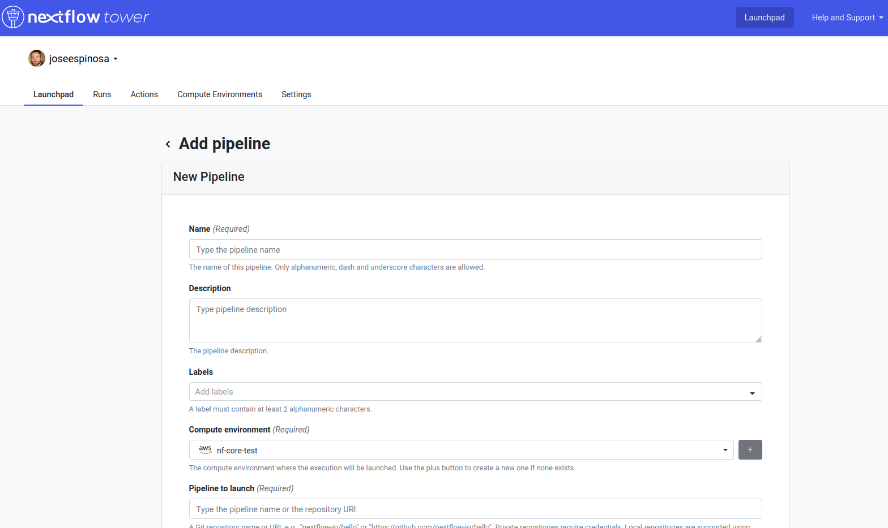

.. _Nextflow_Tower-page:

Nextflow Tower
==============

**Nextflow Tower** it is a browser based graphical interface that allows users to manage, monitor and launch Nextflow pipelines both on-premises
and in the cloud.

.. image:: images/tower.png
  :width: 800
  
.. Note::
    Tower offers an a open source free version and a commercial one. The main difference between them is that the latter enables you to launch and manage
    pipelines on premises (e.g. your institutional HPC) while the latter does not, or at least not in the same manner (you will need to run a daemon 
    in your system called `Tower Agent <https://help.tower.nf/22.2/agent/>`_). 

On this tutorial, we will show how to use the run the nf-core pipeline using the free version of Tower.

First, you need to access the `tower.nf <https://tower.nf/>`__ website and login.

.. image:: images/tower0.png
  :width: 800

Once you reach the launchpad we can press the **Add Pipeline** button shown on the image below:

This will open a menu, shown below, that will allow us to choose which pipeline we would like to run. Any Nextflow pipeline publicly available on Github can be 
loaded by Tower.

You will realise that many of the options that should be provided to run the pipeline are similar to the ones we have already discuss. In this case,
we will discuss how to run the pipeline in AWS batch and for this reason, if you want to replicate this exercise you will need to create an AWS batch
compute environment before hand.

.. tip::
    Tower also enables to forge your AWS batch environment using its graphical interface, you can follow `this <https://help.tower.nf/22.1/compute-envs/aws-batch/#compute-environment>`_ tutorial to create your own 
    compute environment.

Also, to add a pipeline in Tower you will need to provide a **Work directory**. In this case we will be using the 
`Amazon S3 cloud storage system <https://aws.amazon.com/s3/>`_ as the work directory of our pipeline (e.g. ``s3://cbcrg-eu/work``).

You could also define a default parametrization of the pipeline using the **Pipeline parameters** window in the form. 

Once you add your pipeline, it will be available in the **Launchpad** (see figure below) and you will be able to launch the pipeline 
using the Tower GUI. The form to fill the parameters will be loaded thanks to the nf-core JSON schema that is also used by nf-core launch, 
as we have already discussed in the previous session. 

.. ` <>`_