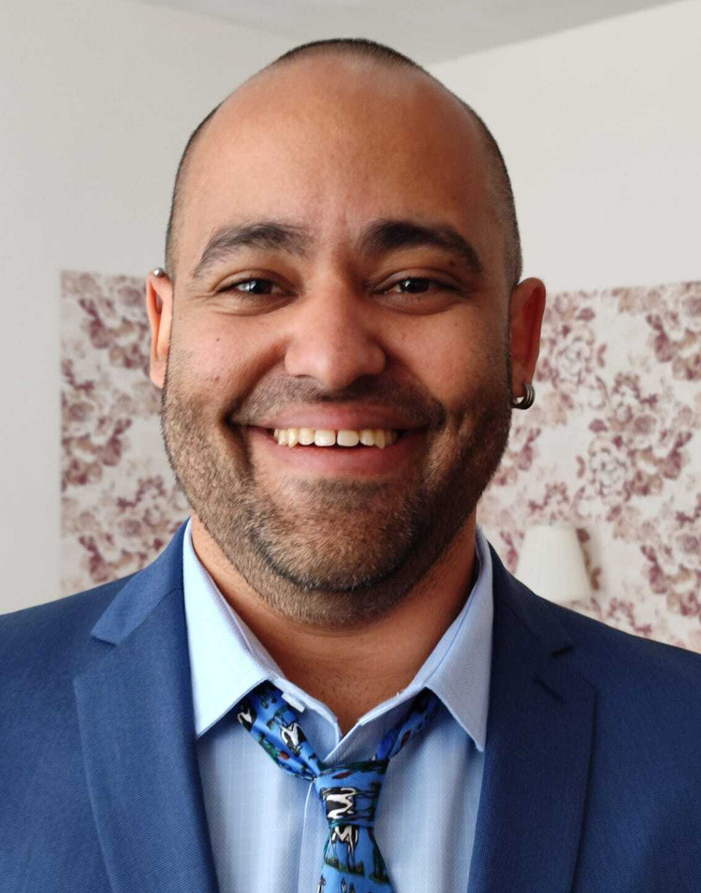
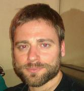

.. _home-page-about:

****************
About the course
****************

.. autosummary::
  :toctree: generated

This is the documentation for the tutorial that will take place on the framework of the 'BOVREG - ATAC-Seq Workshop' 
course organized by the `BovReg project <https://www.bovreg.eu/>`_ in the Université de Limoges.

* `Course page <https://bovreg.github.io/atacseq-workshop-limoges>`_

.. |bjorn| image:: images/blanger.jpg
  :alt: Alternative text

  

.. list-table:: Main instructors:
   :widths: 50 50 50
   :header-rows: 1

   * - Björn Langer
     - Gabriel Costa
     - Jose Espinosa-Carrasco
   * - |bjorn|
     - |gabri|
     - |jespi|

.. _home-page-outline:

Outline
=======

This bioinformatics part of the workshop will train participants to use nf-core pipelines. nf-core is a community that 
maintains a set of Nextflow high-standards pipelines that perform the most common bioinformatics analyses. In particular, 
the practical will consist on a broad introduction on how to run nf-core pipelines with the help of the nf-core tools and 
a more specific section dedicated to the analysis of ATAC-seq data using the nf-core/atacseq pipeline. This pipeline was 
updated in the framework of BovReg to analyse the ATAC-seq data produced by the project.

.. This Linux Containers and Nextflow course will train participants to build Nextflow pipelines and run them with `Singularity <https://sylabs.io/singularity/>`_ containers.

.. It is designed to provide trainees with short and frequent hands-on sessions, while keeping theoretical sessions to a minimum.

.. The course will be fully virtual via the `Zoom <https://zoom.us/>`_ platform. The link will be provided via the `CRG learning platform <https://moodle.crg.eu/>`_.

.. .. 
..         Trainees will work in a dedicated `AWS environment <https://en.wikipedia.org/wiki/AWS/>`_.

.. _home-page-learning:

Learning objectives
===================

* Get familiar with the nf-core pipeline repository.
* Learn main nf-core commands for users.
* Execute nf-core pipelines using nf-core tools.
* Get familiar with the nf-core/atacseq pipeline and its parametrization.
* Discuss pipeline results.
* Run a nf-core pipeline using Tower GUI (Depending on the workshop pace).

.. * Execute/Run a Docker/Singularity container from the command line.
.. * Locate and fetch Nextflow pipelines from dedicated repositories.
.. * Execute/Run a Nextflow pipeline.
.. * Describe and explain Nextflow basic concepts.
.. * Test and modify a Nextflow pipeline.
.. * Implement short blocks of code into a Nextflow pipeline.
.. * Develop a Nextflow pipeline from scratch.
.. * Run a pipeline in diverse computational environments (local, HPC, cloud).
.. * Share a pipeline.

.. _home-page-prereq:

Workshop prerequisites
======================

* UNIX-based environments (i.e. basic UNIX commands).
* Being comfortable working with the CLI (command-line interface) in a Linux-based environment.
* Familiar with scripting languages.
* Basic knowledge of bioinformatics tools.

Being comfortable working with the CLI (command-line interface) in a Linux-based environment.
.. Knowledge of containers is not mandatory. The course materials is online in the dedicated GitHub page for self-learning.

.. Practitioners will need to connect during the course to a remote server via the "ssh" protocotol. You can learn about it `here <https://www.hostinger.com/tutorials/ssh-tutorial-how-does-ssh-work>`_

.. Those who follow the course should be able to use a command-line/screen-oriented text editor (such as nano or vi/vim, which are already available in the server) or to be able to use an editor able to connect remotely. For sake of information, below the basics of `nano <https://wiki.gentoo.org/wiki/Nano/Basics_Guide>`_

.. Having a `GitHub account <https://github.com/join>`_ is recommended.

.. _home-page-dates:

Dates, location and agenda
==========================

* Dates: Wednesday November 9 - Thursday November 10, 2022.

* Location: Faculty of Science and Technology - 123 Avenue Albert Thomas - Building M; Université de Limoges

.. _home-page-agenda:

Suggested agenda
=================

.. _home-page-day1:

Wednesday November 9
---------------------

* 09:00 - 10:30 Setup of the environment and nf-core introduction
* 10:30 - 10:45 Coffee break
* 10:45 - 12:00 nf-core introduction

.. _home-page-day1:

Thursday November 10
--------------------

* 09:00 - 10:30 Introduction to the nf-core/atacseq pipeline
* 10:30 - 10:45 Coffee break
* 10:45 - 12:00 nf-core/atacseq results discussion
